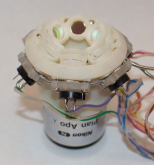

# UV LED Illuminator

This repository contains files for constructing an objective mounted UV epi-illuminator. It consists of six UV LEDs arranged around an objective to illuminate the focal plane. We have used it for excitation with 280 nm LEDs, but it can also be used for exciting fluorescence using visible wavelength LEDs. For UV LEDs the main advantage is that it does not require that the objective transmit the UV wavelengths for excitation. For visible LEDs it provides a simple and compact way to illuminate a sample that does not require a dichroic mirror or filter cube.

# What the files are
* [BillOfMaterials.txt: Parts list for project](BillOfMaterials.txt)
* 3D printed parts for the LED mount:
  * [4x LED ring light 2mm filter.ipt: LED mount that sits on a 4x/0.2 NA objective (Autocad Inventor format)](4x LED ring light 2mm filter.ipt)
  * [4x LED ring light 2mm filter.stl: same part, STL format](4x LED ring light 2mm filter.stl)
  * [LED cooling tubing cap 2.ipt: Clamps to hold the LEDs in place (Autocad Inventor format)](LED cooling tubing cap 2.ipt)
  * [LED cooling tubing cap 2.stl: same part, STL format](LED cooling tubing cap 2.stl)
* 3D printed parts for the water pump enclosure
  * [Pump enclosure MM0312.ipt: Enclosure to hold the water pump (Autocad Inventor format)](Pump enclosure MM0312.ipt)
  * [Pump enclosure MM0312.stl: same part, STL format](Pump enclosure MM0312.stl)
  * [Pump clamp MM0312.ipt: clamp to hold the water pump in place (Autocad Inventor format)](Pump clamp MM0312.ipt)
  * [Pump clamp MM0312.stl: same part, STL format](Pump clamp MM0312.stl)
  * [Pump lid MM0312.ipt: Pump enclosure lid (Autocad Inventor format)](Pump lid MM0312.ipt)
  * [Pump lid MM0312.stl: same part, STL format](Pump lid MM0312.stl)
* Other parts
  * [LED pump controller.ipt: Enclosure for the Arduino that controls the LEDs and water cooling pump (Autocad Inventor format)](LED pump controller.ipt)
  * [LED pump controller.stl: same part, STL format](LED pump controller.stl)
  * [LEDPumpController.ino: Arduino sketh for the pump controller](LEDPumpController.ino)